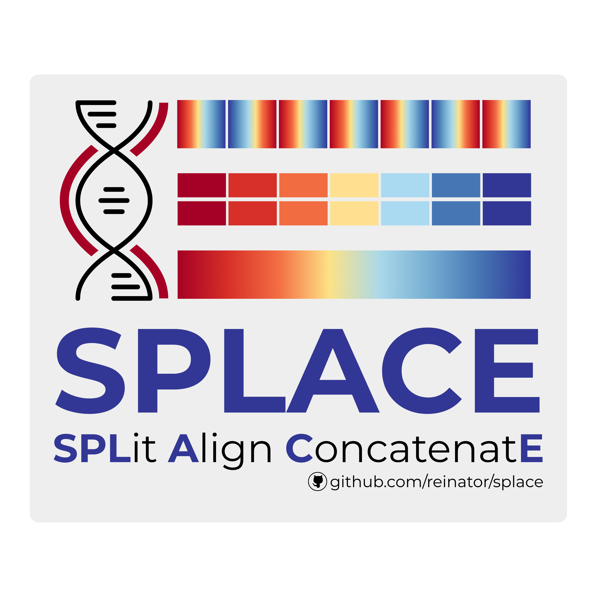

  

    <h1 align="center">SPLACE (<b>SP</b>Lit, <b>A</b>lign and <b>C</b>oncatenat<b>E</b>)</h1>

# Contents Overview
- [System Overview](#system-overview)
- [Licence](#licence)
***
&nbsp;
## System Overview
##### [:rocket: Go to Contents Overview](#contents-overview)
**SPLACE** is a Python toolkit for splitting, aligning, and concatenating gene sequences in phylogenetic pipelines. 
It integrates with **SynGenes** to standardize gene nomenclature across datasets, and uses asynchronous I/O and parallel alignment to accelerate large-scale workflows.
&nbsp;
> [!NOTE]
> This project is a fork of the original SPLACE repository, with enhancements for better performance and usability.
> See the original repository at [https://github.com/reinator/splace/](https://github.com/reinator/splace/)
&nbsp;
## Licence
##### [:rocket: Go to Contents Overview](#contents-overview)
**SPLACE** is released under the **GPL-3.0 License**. This license permits free use, modification, and distribution of the software, provided that any derivative works also adhere to the same license terms.
For more details, please see the [GPL-3.0 License](LICENSE).
&nbsp;
## Getting Started
##### [:rocket: Go to Contents Overview](#contents-overview)
- ## Prerequisites
Before you run **SPLACE**, make sure you have the following prerequisites installed on your system:
- **Python Environment**
    - Python **version 3.12 or higher**
    - conda (optional, but recommended for managing dependencies)
    - singularity or docker (optional, for containerized execution)
- **Required Software and Libraries**
- Dependencies (automatically installed with pip) 
    - `syngenes`
    - `biopython`
    - `mafft`
***  