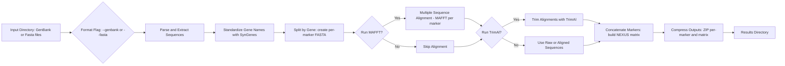

<p align="center">
  
</p>

<p align="center">
    <h1 align="center">SPLACE (<b>SP</b>Lit, <b>A</b>lign and <b>C</b>oncatenat<b>E</b>)</h1>
</p>

# Contents Overview
- [System Overview](#system-overview)
- [Licence](#licence)
- [Getting Started](#getting-started)
  - [Prerequisites](#prerequisites)
  - [Installation](#installation)
  - [Usage](#usage)
    - [Parameter Overview](#parameter-overview)
  - [Example Command](#example-command)
- [SPLACE Workflow](#splace-workflow)
- [Citing SPLACE](#citing-splace)
- [Contact](#contact)

***
&nbsp;
## System Overview
##### [:rocket: Go to Contents Overview](#contents-overview)
**SPLACE** is a Python toolkit for splitting, aligning, and concatenating gene sequences in phylogenetic pipelines. 
It integrates with **SynGenes** to standardize gene nomenclature across datasets, and uses asynchronous I/O and parallel alignment to accelerate large-scale workflows.
&nbsp;
> [!NOTE]
> This project is a fork of the original SPLACE repository, with enhancements for better performance and usability.
> See the original repository at [https://github.com/reinator/splace/](https://github.com/reinator/splace/)
&nbsp;
## Licence
##### [:rocket: Go to Contents Overview](#contents-overview)
**SPLACE** is released under the **GPL-3.0 License**. This license permits free use, modification, and distribution of the software, provided that any derivative works also adhere to the same license terms.
For more details, please see the [GPL-3.0 License](LICENSE).
&nbsp;
## Getting Started
##### [:rocket: Go to Contents Overview](#contents-overview)
### Prerequisites
Before you run **SPLACE**, make sure you have the following prerequisites installed on your system:
- **Python Environment and Package Manager**
    - Python **version 3.12 or higher**
    - conda
    - git
    - singularity or docker (optional, but recommended for containerized execution)
- **Required Software and Libraries**
    - `biopython` # For biological sequence handling and parsing
    - `syngenes`  # For gene nomenclature standardization
    - `mafft`     # For multiple sequence alignment
    - `trimal`    # For automated alignment trimming
    - `openpyxl`  # For Excel file handling
&nbsp;
## Installation
##### [:rocket: Go to Contents Overview](#contents-overview)
#### Conda
1. Download and install Miniconda or Anaconda from [https://docs.conda.io/en/latest/miniconda.html](https://docs.conda.io/en/latest/miniconda.html) or [https://www.anaconda.com/products/distribution](https://www.anaconda.com/products/distribution) respectively.
2. Clone the **SPLACE** repository and install the required dependencies by following these steps:
- 2.1. Open the **Terminal**
- 2.2. Execute the following command:
```shell
git clone https://github.com/luanrabelo/SPLACE.git
cd SPLACE  
conda env create -f environment.yml
```
&nbsp;
- 2.3. Activate the conda environment:
```shell
conda activate splace_env
```
> [!NOTE]
> This will **clone the repository**, then you should navigate to the cloned directory to create the conda environment using the provided `environment.yml` file.
> After installation, activate the conda environment with: `conda activate splace_env`
&nbsp;  
## Usage
#### Parameter Overview
##### [:rocket: Go to Contents Overview](#contents-overview)
| Parameter | Description |
|-----------|-----------|
| `--input` | Path to the directory containing **GenBank** or **Fasta** files. |
| `--output` | Path to the output directory where results will be saved. All marker files will be stored in zipped format, containing aligned and trimmed sequences, and a concatenated matrix, in **NEXUS** format for phylogenetic analysis. |
| `-t` | Number of threads to use for parallel processing. |
| `--genbank` | Flag to indicate that the input files are in **GenBank** format. |
| `--fasta` | Flag to indicate that the input files are in **Fasta** format. |
| `--mafft` | Flag to enable multiple sequence alignment using **MAFFT**. |
| `--trimal` | Flag to enable automated alignment trimming using **TrimAl**. |
&nbsp;
#### Example Command
##### [:rocket: Go to Contents Overview](#contents-overview)
After installing **SPLACE** and activating the conda environment, you can run the tool using the command line interface. Here’s a basic example of how to use **SPLACE**:
- Run the following command in your terminal for processing **GenBank** files with **MAFFT** and **TrimAl**:
```shell
splace.py --input /path/to/your/gb_files --output /path/to/your/your_output_directory -t 8 --genbank --mafft --trimal
```
- For processing **Fasta** files, use the following command:
```shell
splace.py --input /path/to/your/fasta_files --output /path/to/your/your_output_directory -t 8 --fasta --mafft --trimal
```
> [!NOTE]
> Make sure to replace `/path/to/your/gb_files`, `/path/to/your/fasta_files`, and `/path/to/your/your_output_directory` with the actual paths on your system.  
> The `-t` parameter specifies the number of threads to use for parallel processing. Adjust this based on your system's capabilities.  
> The `--mafft` and `--trimal` flags enable multiple sequence alignment and trimming, respectively. You can omit these flags if you do not wish to perform these steps.  
> Do not use both `--genbank` and `--fasta` flags together; choose one based on your input file format.  
> For more detailed usage instructions and additional options, refer to the help command:
```shell
splace.py --help
```
&nbsp;
> [!CAUTION]
> For **Fasta files**, ensure that the sequence headers are formatted correctly to include gene names for proper processing by **SPLACE**.
> Example header format:
> ```
> > lcl|PX070005.1_cds_XZP64796.1_3 [gene=COX1] [protein=cytochrome c oxidase subunit I] [protein_id=XZP64796.1] [location=5509..7059] [gbkey=CDS]
> ATGGC...
> ```
> In this example, the gene name is specified as `COX1` ([gene=COX1]) and after standardization by **SynGenes**, it will be recognized as `COI` and written accordingly in the output files. This example header is a standard format for GenBank-derived Fasta files.  
> **Recommended practice is to use Fasta files generated from GenBank files to ensure compatibility.**  
> Alternatively, for custom Fasta files, ensure the headers follow a similar structure to include the gene name, such as:
> ```
> > atp6_ITV1046I2 atp6 ATP synthase F0 subunit 6 7964:8638 forward
> ATGGC...
> ```
> In this case, the header splits into parts, using spaces as delimiters, where the second part (`atp6`) indicates the gene name. After standardization, it will be recognized as `ATP6` in the output files.  
> If your Fasta headers, after splitting by spaces, do not have the gene name in the second position, SPLACE uses the first part of the header as the gene name. This may lead to inconsistencies if the gene names are not standardized.
&nbsp;
## SPLACE Workflow
##### [:rocket: Go to Contents Overview](#contents-overview)

Below is an intuitive end-to-end view of how SPLACE processes your sequence data. You start by choosing the input format (GenBank or Fasta), then SPLACE standardizes gene names, splits per marker, optionally aligns and trims, and finally concatenates the alignments into a phylogenetic-ready matrix.



### Main Stages
| Stage | What Happens | Generated Files |
|-------|---------------|-----------------|
| 1. Read | Reads GenBank or Fasta files according to the chosen flag. | (in memory) |
| 2. Standardize | Uses SynGenes to normalize gene names (e.g., COX1 -> COI). | standardized temporary FASTA |
| 3. Split | Creates an individual FASTA for each gene/marker. | `gene_name.fasta` per marker |
| 4. Align (optional) | MAFFT runs in parallel for each marker. | `gene_name.aln.fasta` |
| 5. Trim (optional) | TrimAl removes low-quality alignment regions. | `gene_name.trim.fasta` |
| 6. Concatenate | Joins all markers into a concatenated matrix (NEXUS). | `concatenated_matrix.nexus` |
| 7. Package | Groups markers (and alignments) and compresses. | `markers.zip`, `matrix.nexus` |

### Final Output
In the directory defined by `--output`, you'll find:
- Zipped files containing per-marker FASTA (raw, aligned and/or trimmed depending on flags).
- The concatenated matrix in NEXUS format ready for phylogenetic analysis.
- Logs or auxiliary reports (if implemented in the version you are using).

### Execution Decisions
- Use `--genbank` to extract directly from rich annotations (recommended to preserve metadata).
- Use `--fasta` when you already have clean FASTA files (ensure headers include the gene name in the expected position as described above).
- Omitting `--mafft` skips the alignment step (useful for quick tests).
- Omitting `--trimal` keeps full alignments (useful when you want to manually inspect regions before trimming).

### Simplified Examples
| Goal | Command |
|------|---------|
| Full GenBank pipeline | `splace.py --input data/gb --output results -t 8 --genbank --mafft --trimal` |
| Split + concatenate (Fasta only) | `splace.py --input data/fasta --output results -t 4 --fasta` |
| Align without trimming | `splace.py --input data/gb --output results -t 8 --genbank --mafft` |

> Tip: Adjust `-t` (threads) according to available CPU cores. For many markers and large alignments, more threads speed up MAFFT.


## Citing **SPLACE**
##### [:rocket: Go to Contents Overview](#contents-overview)
When referencing the **SPLACE** class, please cite it appropriately in your academic or professional work.
```
Oliveira, R. R., Vasconcelos, S., & Oliveira, G. (2022). SPLACE: A tool to automatically SPLit, Align, and ConcatenatE genes for phylogenomic inference of several organisms. Frontiers in Bioinformatics, 2.\
https://doi.org/10.3389/fbinf.2022.1074802
```
***  
## Contact
##### [:rocket: Go to Contents Overview](#contents-overview)
For reporting bugs, requesting assistance, or providing feedback, please reach out to **Luan Rabelo**:
```
luanrabelo@outlook.com
```
***  