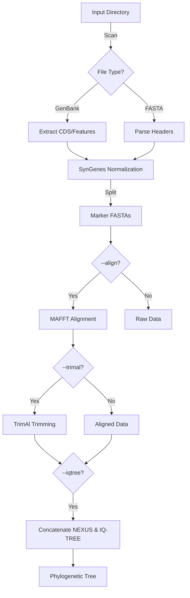

<p align="center">
  
</p>

<p align="center">
    <h1 align="center">SPLACE (<b>SP</b>Lit, <b>A</b>lign and <b>C</b>oncatenat<b>E</b>)</h1>
</p>

# Contents Overview
- [System Overview](#system-overview)
- [Licence](#licence)
- [Getting Started](#getting-started)
  - [Prerequisites](#prerequisites)
  - [Installation](#installation)
  - [Usage](#usage)
    - [Parameter Overview](#parameter-overview)
  - [Example Command](#example-command)
- [SPLACE Workflow](#splace-workflow)
- [Citing SPLACE](#citing-splace)
- [Contact](#contact)

***
&nbsp;
## System Overview
##### [:rocket: Go to Contents Overview](#contents-overview)
**SPLACE** is a comprehensive Python toolkit designated to automate phylogenomic analysis pipelines. It handles gene splitting, alignment, trimming, and concatenation, and now supports direct phylogenetic tree inference.

It integrates with **SynGenes** for gene name standardization, **MAFFT** for alignment, **TrimAl** for quality control, and **IQ-TREE** for phylogeny reconstruction, utilizing asynchronous I/O and parallel processing for high performance.

**Key Features:**
*   **Automatic Extraction:** Detects and extracts CDS from GenBank files or genes from FASTA headers suitable for SynGenes.
*   **Gene Normalization:** Ensures consistent gene naming across datasets.
*   **Alignment & Trimming:** Automated MSA and cleaning steps.
*   **Phylogeny:** Supermatrix generation to NEXUS format and ML tree inference with IQ-TREE.
*   **Benchmarking:** Metrics for pipeline performance analysis.

### Version Comparison

| Feature | SPLACE v2/v3 (Legacy) | SPLACE (New) |
| :--- | :--- | :--- |
| **Input Method** | Text file list | Automatic Directory Scan |
| **Execution** | Sequential | Asynchronous & Parallel |
| **Gene Normalization** | basic string split | **SynGenes** Integration |
| **Phylogeny** | Concatenation Only | **IQ-TREE** Integration |
| **Benchmarking** | Manual / Not Built-in | Native (`--benchmark`) |
| **Language/Deps** | Python <3.10 | Python 3.12+ (Asyncio) |

&nbsp;
> [!NOTE]
> This project is an enhanced version of the original SPLACE repository.
> See the original repository at [https://github.com/reinator/splace/](https://github.com/reinator/splace/)

&nbsp;
## Licence
##### [:rocket: Go to Contents Overview](#contents-overview)
**SPLACE** is released under the **GPL-3.0 License**.
&nbsp;

## Getting Started
##### [:rocket: Go to Contents Overview](#contents-overview)
### Prerequisites
Before you run **SPLACE**, make sure you have the following prerequisites installed on your system:
- **Python Environment and Package Manager**
    - Python **version 3.12 or higher**[^1]
    - conda[^1]
    - git[^1]
- **Required Software and Libraries**
    - `mafft`     # For multiple sequence alignment (REQUIRED for --align)
    - `trimal`    # For automated alignment trimming (REQUIRED for --trimal)
    - `iqtree`    # For phylogeny (REQUIRED for --iqtree)
    - `biopython` # For biological sequence handling and parsing
    - `syngenes`  # For gene nomenclature standardization
[^1]: These prerequisites are essential for running SPLACE effectively.

&nbsp;
## Installation
##### [:rocket: Go to Contents Overview](#contents-overview)
#### Conda (Recommended)

1. Clone the repository:
```shell
git clone https://github.com/luanrabelo/SPLACE.git
cd SPLACE  
```

2. Create and activate the environment:
```shell
conda env create -f environment.yml
conda activate splace
```

#### Pip
If you prefer not to use Conda:
```bash
pip install -e .
```

&nbsp;  
## Usage
#### Parameter Overview
##### [:rocket: Go to Contents Overview](#contents-overview)

The basic syntax is `python splace.py [input_dir] [output_dir] [options]`.

| Parameter | Function | Description |
|-----------|-----------|-------------|
| `input_dir` | Input | Path to directory containing **GenBank** or **Fasta** files. |
| `output_dir` | Output | Directory where results will be saved. |
| `--gb-type` | Extraction | Type of Genbank data: `mt` (mitochondrial) or `cp` (chloroplast). Default: `mt`. |
| `--align` | Alignment | Enable multiple sequence alignment using **MAFFT**. |
| `--trimal` | Trimming | Enable trimming using **TrimAl**. |
| `--iqtree` | Phylogeny | Enable phylogenetic inference using **IQ-TREE**. |
| `--benchmark` | Performance | Enable execution time benchmarking. |
| `-t`, `--threads` | Performance | Number of threads for parallel processing. Default: 4. |

&nbsp;
#### Example Command
##### [:rocket: Go to Contents Overview](#contents-overview)
After installing **SPLACE** and activating the conda environment:

**Full Pipeline (Extract -> Align -> Trim -> Tree)**
```shell
python splace.py data/raw/ results/ --gb-type mt --align --trimal --iqtree --threads 8 --benchmark
```

**Extraction and Alignment Only**
```shell
python splace.py data/raw/ results_aln/ --gb-type mt --align --threads 4
```

> [!NOTE]
> The script automatically detects input file formats (.gb, .fasta, etc).
> `--iqtree` requires `--trimal` to be active.

&nbsp;
> [!CAUTION]
> For **Fasta files**, ensure that the sequence headers are formatted correctly to include gene names for proper processing by **SPLACE**.
> Example header format with SynGenes support:
> ```
> > lcl|PX070005.1_cds_XZP64796.1_3 [gene=COX1] ...
> ```
> Or simple formats where the gene name is clear.

&nbsp;
## SPLACE Workflow
##### [:rocket: Go to Contents Overview](#contents-overview)



## Citing **SPLACE**
##### [:rocket: Go to Contents Overview](#contents-overview)
When referencing the **SPLACE**, please cite:
```
Oliveira, R. R., Vasconcelos, S., & Oliveira, G. (2022). SPLACE: A tool to automatically SPLit, Align, and ConcatenatE genes for phylogenomic inference of several organisms. Frontiers in Bioinformatics, 2.
https://doi.org/10.3389/fbinf.2022.1074802
```
***  
## Contact
##### [:rocket: Go to Contents Overview](#contents-overview)
For reporting bugs or feedback, please reach out to **Luan Rabelo**: `luanrabelo@outlook.com`
***  