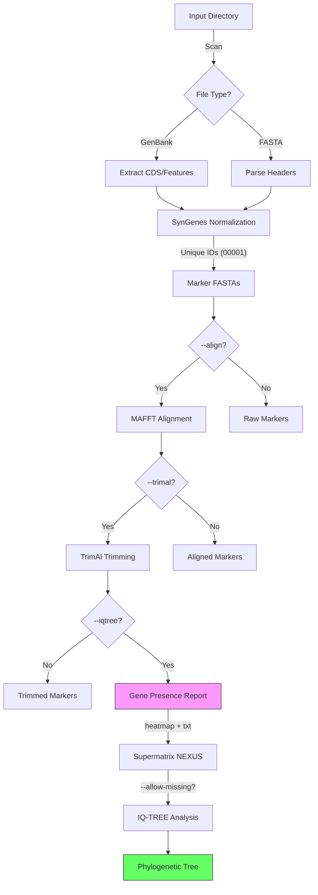

<p align="center">
  
</p>

<p align="center">
    <h1 align="center">SPLACE (<b>SP</b>Lit, <b>A</b>lign and <b>C</b>oncatenat<b>E</b>)</h1>
</p>

### Platform Compatibility

| Operating System | Status |
|:---|:---|
| Ubuntu |  |
| macOS |  |
| Windows |  |

# Contents Overview
- [System Overview](#system-overview)
- [Licence](#licence)
- [Getting Started](#getting-started)
  - [Prerequisites](#prerequisites)
  - [Installation](#installation)
  - [Usage](#usage)
    - [Parameter Overview](#parameter-overview)
  - [Example Command](#example-command)
  - [Tool Configuration](#tool-configuration)
  - [Gene Presence Report](#gene-presence-report)
  - [Sequence Identifiers](#sequence-identifiers)
- [SPLACE Workflow](#splace-workflow)
- [Citing SPLACE](#citing-splace)
- [Contact](#contact)

***
&nbsp;
## System Overview
##### [:rocket: Go to Contents Overview](#contents-overview)
**SPLACE** is a comprehensive Python toolkit designated to automate phylogenomic analysis pipelines. It handles gene splitting, alignment, trimming, and concatenation, and now supports direct phylogenetic tree inference.

It integrates with **SynGenes** for gene name standardization, **MAFFT** for alignment, **TrimAl** for quality control, and **IQ-TREE** for phylogeny reconstruction, utilizing asynchronous I/O and parallel processing for high performance.

**Key Features:**
*   **Automatic Extraction:** Detects and extracts CDS from GenBank files or genes from FASTA headers suitable for SynGenes.
*   **Gene Normalization:** Ensures consistent gene naming across datasets.
*   **Alignment & Trimming:** Automated MSA and cleaning steps.
*   **Phylogeny:** Supermatrix generation to NEXUS format and ML tree inference with IQ-TREE.
*   **Benchmarking:** Metrics for pipeline performance analysis.

### Version Comparison

| Feature | SPLACE v2/v3 (Legacy) | SPLACE (New) |
| :--- | :--- | :--- |
| **Input Method** | Text file list | Automatic Directory Scan |
| **Execution** | Sequential | Asynchronous & Parallel |
| **Gene Normalization** | basic string split | **SynGenes** Integration |
| **Phylogeny** | Concatenation Only | **IQ-TREE** Integration |
| **Benchmarking** | Manual / Not Built-in | Native (`--benchmark`) |
| **Language/Deps** | Python <3.10 | Python 3.12+ (Asyncio) |

&nbsp;
> [!NOTE]
> This project is an enhanced version of the original SPLACE repository.
> See the original repository at [https://github.com/reinator/splace/](https://github.com/reinator/splace/)

&nbsp;
## Licence
##### [:rocket: Go to Contents Overview](#contents-overview)
**SPLACE** is released under the **GPL-3.0 License**.
&nbsp;

## Getting Started
##### [:rocket: Go to Contents Overview](#contents-overview)
### Prerequisites
Before you run **SPLACE**, make sure you have the following prerequisites installed on your system:
- **Python Environment and Package Manager**
    - Python **version 3.12 or higher**[^1]
    - conda[^1]
    - git[^1]
- **Required Software and Libraries**
    - `mafft`     # For multiple sequence alignment (REQUIRED for --align)
    - `trimal`    # For automated alignment trimming (REQUIRED for --trimal)
    - `iqtree`    # For phylogeny (REQUIRED for --iqtree)
    - `biopython` # For biological sequence handling and parsing
    - `syngenes`  # For gene nomenclature standardization
[^1]: These prerequisites are essential for running SPLACE effectively.

&nbsp;
## Installation
##### [:rocket: Go to Contents Overview](#contents-overview)
#### Conda (Recommended)

1. Clone the repository:
```shell
git clone https://github.com/luanrabelo/SPLACE.git
cd SPLACE  
```

2. Create and activate the environment:
```shell
conda env create -f environment.yml
conda activate splace
```

#### Pip
If you prefer not to use Conda:
```bash
pip install -e .
```

&nbsp;  
## Usage
#### Parameter Overview
##### [:rocket: Go to Contents Overview](#contents-overview)

The basic syntax is `python splace.py [input_dir] [output_dir] [options]`.

| Parameter | Function | Description |
|-----------|-----------|-------------|
| `input_dir` | Input | Path to directory containing **GenBank** or **Fasta** files. |
| `output_dir` | Output | Directory where results will be saved. |
| `--gb-type` | Extraction | Type of Genbank data: `mt` (mitochondrial) or `cp` (chloroplast). Default: `mt`. |
| `--genes` | Filtering | Comma-separated gene names (e.g., `12S,16S,COI`) or path to a text file (one gene per line). Default: built-in list per `--gb-type`. |
| `--feature-types` | Filtering | Comma-separated GenBank feature types to extract (e.g., `CDS,rRNA,tRNA`). Default: `CDS`. |
| `--align` | Alignment | Enable multiple sequence alignment using **MAFFT**. |
| `--trimal` | Trimming | Enable trimming using **TrimAl**. |
| `--iqtree` | Phylogeny | Enable phylogenetic inference using **IQ-TREE**. |
| `--allow-missing` | Phylogeny | Allow missing data in the supermatrix (fills with `?`). Without this flag, genes absent from any taxon are removed. |
| `--overwrite` | Output | Overwrite existing output directories if they already exist. Without this flag, SPLACE exits with an error when output directories are present. |
| `--benchmark` | Performance | Enable execution time benchmarking. |
| `-t`, `--threads` | Performance | Number of threads for parallel processing. Default: 4. |
| `--config` | Configuration | Path to a YAML file with custom parameters for MAFFT, TrimAl, and IQ-TREE. See [Tool Configuration](#tool-configuration). |

&nbsp;
#### Example Command
##### [:rocket: Go to Contents Overview](#contents-overview)
After installing **SPLACE** and activating the conda environment:

**Full Pipeline (Extract -> Align -> Trim -> Tree)**
```shell
python splace.py data/raw/ results/ --gb-type mt --align --trimal --iqtree --threads 8 --benchmark
```

**Extraction and Alignment Only**
```shell
python splace.py data/raw/ results_aln/ --gb-type mt --align --threads 4
```

> [!NOTE]
> The script automatically detects input file formats (.gb, .fasta, etc).
> `--iqtree` requires `--trimal` to be active.

&nbsp;
> [!CAUTION]
> For **Fasta files**, ensure that the sequence headers are formatted correctly to include gene names for proper processing by **SPLACE**.
> Example header format with SynGenes support:
> ```
> > lcl|PX070005.1_cds_XZP64796.1_3 [gene=COX1] ...
> ```
> Or simple formats where the gene name is clear.

&nbsp;
## Tool Configuration
##### [:rocket: Go to Contents Overview](#contents-overview)

You can customize the parameters of **MAFFT**, **TrimAl**, and **IQ-TREE** by providing a YAML configuration file via the `--config` flag. A default template is included in the repository as `tools_config.yaml`.

```shell
python splace.py -i data/raw/ -o results/ --gb-type mt --align --trimal --iqtree --config tools_config.yaml
```

#### Configuration File Format

```yaml
mafft:
  # Additional MAFFT parameters (e.g., "--auto", "--localpair --maxiterate 1000")
  params: "--auto"
  # Preserve original case of sequences (uppercase/lowercase)
  preserve_case: true
  # Maximum time (in seconds) allowed per alignment
  timeout: 3600

trimal:
  # TrimAl trimming strategy (e.g., "-automated1", "-gappyout", "-strict")
  params: "-automated1"
  # Maximum time (in seconds) allowed per trimming
  timeout: 3600

iqtree:
  # Number of ultrafast bootstrap replicates (-B)
  bootstrap: 1000
  # Substitution model (-m). Use "MFP" for automatic ModelFinder selection
  model: "MFP"
  # Any extra IQ-TREE arguments (e.g., "-alrt 1000" for SH-aLRT test)
  extra_args: ""
```

#### Parameter Reference

| Section | Parameter | Default | Description |
|:---|:---|:---|:---|
| `mafft` | `params` | `--auto` | MAFFT alignment strategy. See [MAFFT documentation](https://mafft.cbrc.jp/alignment/software/manual/manual.html). |
| `mafft` | `preserve_case` | `true` | Keep original sequence case (upper/lowercase). |
| `mafft` | `timeout` | `3600` | Max seconds per alignment job. |
| `trimal` | `params` | `-automated1` | TrimAl trimming method. Alternatives: `-gappyout`, `-strict`, `-gt 0.8`, etc. |
| `trimal` | `timeout` | `3600` | Max seconds per trimming job. |
| `iqtree` | `bootstrap` | `1000` | Ultrafast bootstrap replicates (`-B`). |
| `iqtree` | `model` | `MFP` | Substitution model (`-m`). `MFP` runs ModelFinder automatically. |
| `iqtree` | `extra_args` | *(empty)* | Additional IQ-TREE flags (e.g., `-alrt 1000 -abayes`). |

> [!NOTE]
> If `--config` is not provided, SPLACE uses the default values shown above. You only need to include the sections you want to override — missing sections will use their defaults.

&nbsp;
## Gene Presence Report
##### [:rocket: Go to Contents Overview](#contents-overview)

When phylogenetic analysis is enabled (`--iqtree`), SPLACE automatically generates a **gene presence/absence report** before building the supermatrix. This report helps you identify which taxa are missing which genes — especially useful with `--allow-missing` or when working with chloroplast datasets that contain many genes.

#### Outputs

| File | Location | Description |
|:---|:---|:---|
| `gene_presence_report.txt` | Main output directory | ASCII table printed to console and saved as text. Shows `+` (present) / `-` (absent) per gene per taxon, with totals. |
| `gene_presence_heatmap.png` | Main output directory | Visual heatmap generated with seaborn. Rows are taxa (species in *italic* with accession number and unique ID), columns are genes. Green = present, red = absent. |

#### Example Heatmap

The heatmap provides a quick visual overview of data completeness across your dataset:
- **Rows**: taxa labeled as *Genus species* (Accession) [UID]
- **Columns**: gene names
- **Colors**: green (`Present`) / red (`Absent`)

The figure size adjusts dynamically based on the number of taxa and genes, ensuring readability even for large chloroplast datasets.

> [!TIP]
> Use the heatmap to decide whether `--allow-missing` is appropriate for your dataset. If most cells are green with only a few scattered red cells, allowing missing data is generally safe.

&nbsp;
## Sequence Identifiers
##### [:rocket: Go to Contents Overview](#contents-overview)

Each sequence extracted by SPLACE receives a unique **5-digit identifier** appended to its FASTA header. This ensures that every record is distinguishable, even when multiple GenBank files contain the same species and accession number (common in population-level studies).

#### Header Format

```
>Genus_species_AccessionID_00001
```

| Component | Example | Description |
|:---|:---|:---|
| Species name | `Coffea_arabica` | Organism name with underscores (spaces removed for compatibility with MAFFT/TrimAl). |
| Accession | `NC_008535.1` | GenBank accession or source identifier. |
| Unique ID | `00001` | Sequential 5-digit identifier, unique per record. |

#### Examples

```
>Coffea_arabica_NC_008535.1_00003
>Carajasia_cangae_Asm_Contig_00001
>Carajasia_cangae_Asm_Contig_00002
>Cinchona_officinalis_OP946451.1_00004
```

> [!NOTE]
> The unique ID is generated at extraction time and remains consistent across all gene files for the same record. This means `Coffea_arabica_NC_008535.1_00003` will appear with the same ID in every gene FASTA file (e.g., `atpB.fasta`, `rbcL.fasta`, etc.).

&nbsp;
## SPLACE Workflow
##### [:rocket: Go to Contents Overview](#contents-overview)


```mermaid
graph TD
    A[Input Directory] -->|Scan| B{File Type?}
    B -->|GenBank| C[Extract CDS/Features]
    B -->|FASTA| D[Parse Headers]
    C --> E[SynGenes Normalization]
    D --> E
    E -->|"Unique IDs (00001)"| F[Marker FASTAs]
    F --> G{--align?}
    G -->|Yes| H[MAFFT Alignment]
    G -->|No| END1[Raw Markers]
    H --> J{--trimal?}
    J -->|Yes| K[TrimAl Trimming]
    J -->|No| END2[Aligned Markers]
    K --> M{--iqtree?}
    M -->|No| END3[Trimmed Markers]
    M -->|Yes| R[Gene Presence Report]
    R -->|"heatmap + txt"| S[Supermatrix NEXUS]
    S -->|"--allow-missing?"| T[IQ-TREE Analysis]
    T --> O[Phylogenetic Tree]

    style R fill:#f9f,stroke:#333
    style O fill:#6f6,stroke:#333
```

## Citing **SPLACE**
##### [:rocket: Go to Contents Overview](#contents-overview)
When referencing the **SPLACE**, please cite:
```
Oliveira, R. R., Vasconcelos, S., & Oliveira, G. (2022). SPLACE: A tool to automatically SPLit, Align, and ConcatenatE genes for phylogenomic inference of several organisms. Frontiers in Bioinformatics, 2.
https://doi.org/10.3389/fbinf.2022.1074802
```
***  
## Contact
##### [:rocket: Go to Contents Overview](#contents-overview)
For reporting bugs or feedback, please reach out to **Luan Rabelo**: `luan.rabelo@pq.itv.org`
***  